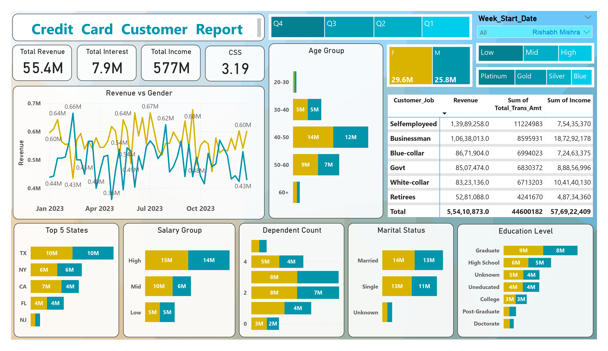
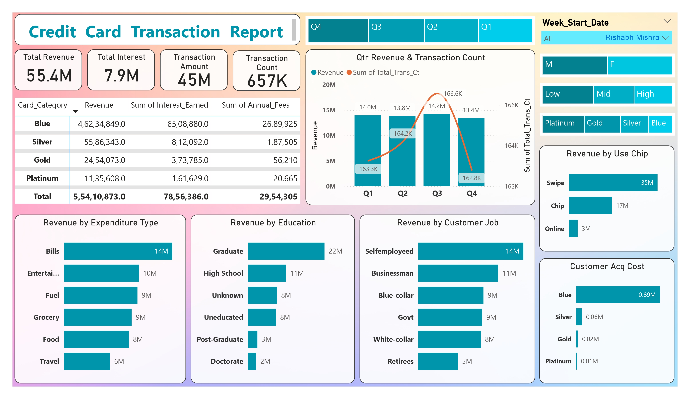

# Credit_Card_Financial_Dashboard

This project aims to develop a **Comprehensive Credit Card Weekly Dashboard** using Power BI, which provides real-time insights into key performance metrics and trends in credit card operations. This dashboard allows stakeholders to effectively monitor and analyze credit card transactions, customer behavior, and other critical metrics on a weekly basis.

## Project Overview

The main goal of this project is to:

1. **Import Credit Card Transaction Data into PostgreSQL** from a CSV file.
2. **Transform and Aggregate Data** to calculate weekly metrics.
3. **Visualize Key Performance Metrics** using Power BI to create an interactive, real-time dashboard that provides insights into credit card operations.

### Key Features of the Dashboard:

- **Weekly Transaction Volume**: Track the number of credit card transactions each week.
- **Total Spend**: Calculate the total amount spent by cardholders during the week.
- **Top Merchants**: Identify the merchants where customers are spending the most each week.
- **Customer Segmentation**: Analyze spending patterns and segment customers based on behavior (e.g., high spenders, frequent users).
- **Fraud Detection Insights**: Track potential fraudulent activity by monitoring unusual spending patterns.
- **Trends Over Time**: Visualize weekly trends in transactions, customer behavior, and spend categories.

## Technologies Used

- **PostgreSQL**: A relational database to store and manage credit card transaction data.
- **Power BI**: A data visualization tool to create an interactive and real-time dashboard.
- **CSV**: Data is initially provided in CSV format before being imported into PostgreSQL.
  
## Data Flow & Process

### 1. Import Credit Card Transaction Data into PostgreSQL

- Credit card transaction data is provided in a **CSV file**.
- The data is imported into PostgreSQL using SQL commands (e.g., `COPY` or `\copy`), creating a table that stores transaction details such as:
  - `transaction_id`: Unique identifier for each transaction.
  - `customer_id`: ID of the customer making the transaction.
  - `transaction_date`: Date of the transaction.
  - `amount`: Transaction amount.
  - `merchant`: Merchant name.
  - `category`: Category of the transaction (e.g., groceries, entertainment).


### Key Enhancements for the Weekly Dashboard:

1. **Weekly Aggregation**: The dashboard should focus on displaying weekly data, aggregating the transactions, spend, and customer metrics on a weekly basis.
2. **Fraud Detection**: It's essential to highlight unusual or potentially fraudulent patterns, such as spikes in spending.
3. **Trends and Analysis**: Use line charts, bar charts, and slicers to visualize how credit card transaction metrics change week-over-week.
4. **Key Metrics**: The dashboard should have metrics that stakeholders can use to make decisions, such as total spend, number of transactions, top merchants, and customer segmentation.

This `README.md` should now provide a clear structure for stakeholders and developers on how to set up, develop, and maintain the **Credit Card Weekly Dashboard** using Power BI and PostgreSQL.

```bash
```
customer dashboard


transaction dashboard


```

